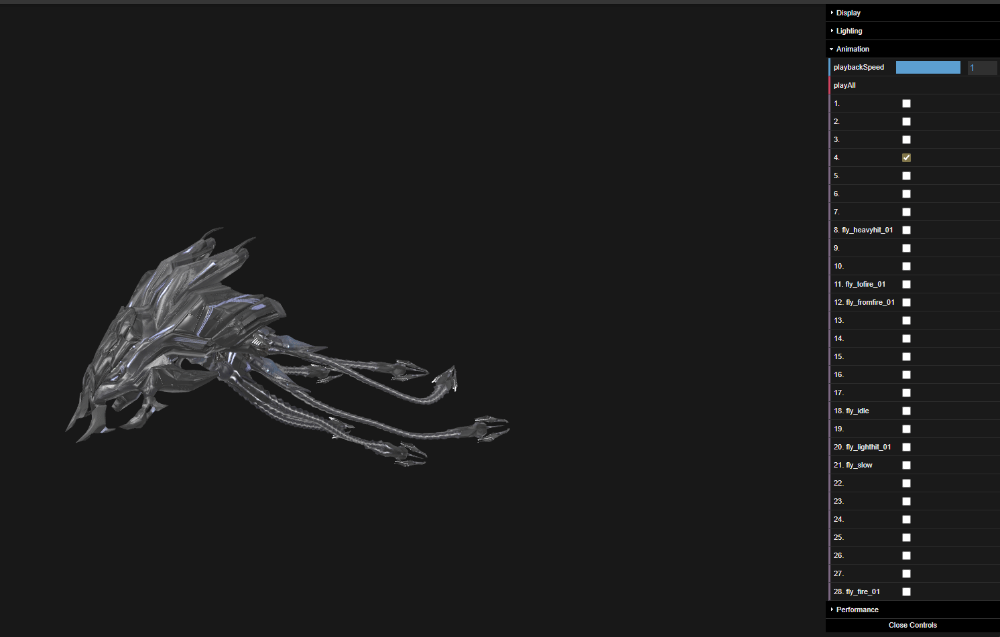
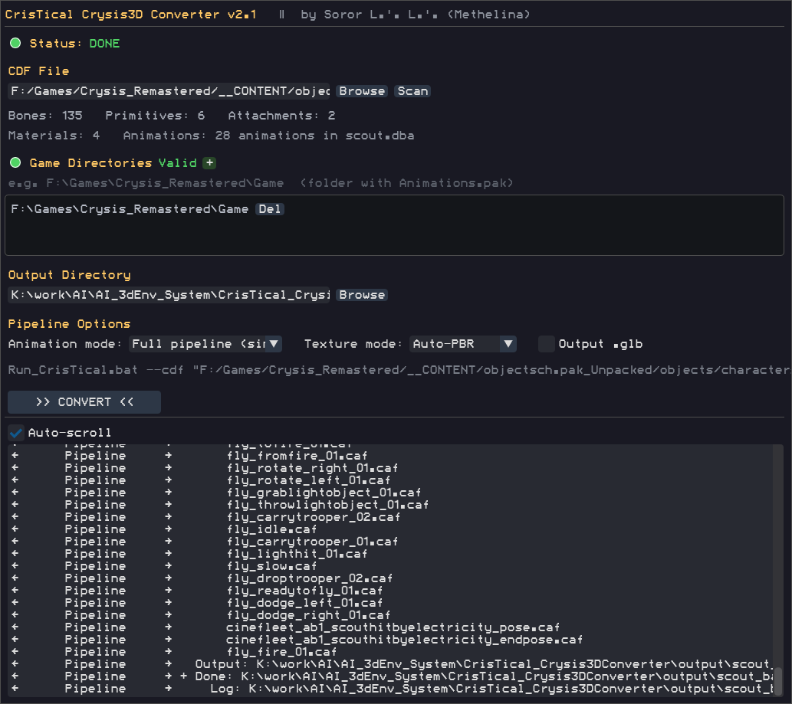
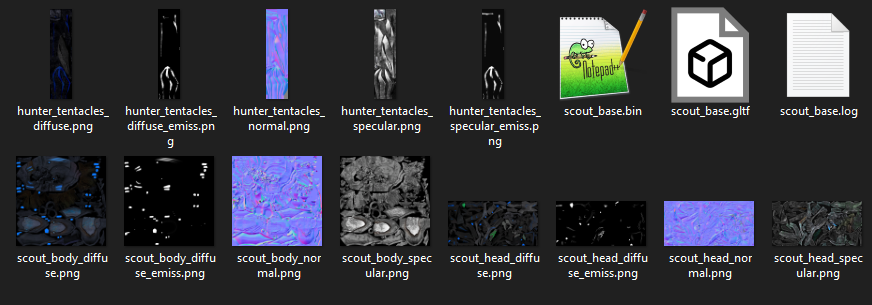

# CrisTical Crysis3D Converter

Converts Crysis 1 characters (original + Remaster) to glTF 2.0.
Uses `.cdf` (Character Definition File) as the root assembly point,
merging the main model with all attachments into a single output.
Also converts **static geometry** (`.cgf` vegetation, props) without a skeleton.

Reads data from binary .chr/.cgf/.dba/.mtl files using CryEngine format specifications. No third-party converters required.

**Author:** Soror L.'.L.'. aka Methelina &nbsp;|&nbsp; **Version:** 2.1 &nbsp;|&nbsp; **License:** Apache 2.0



---

## Features

- **CDF assembly** — auto-merge Model + CA_SKIN Attachments into one glTF
- **Skeleton** — full bone hierarchy with correct inverse-bind matrices
- **Mesh** — all primitives with POSITION/NORMAL/UV/JOINTS/WEIGHTS
- **Static CGF** — `cgf2gltf.py` reads skeleton-free geometry (Mesh/Node/DataStream/MeshSubsets chunks) with **vertex colors → COLOR_0** and **tangents → TANGENT** preserved (int16 SMeshTangents unpacked), node hierarchy baked into world space
- **Animations** — supports DBA v0903 (original) and v0905 (Remaster)
- **Textures** — auto-convert DDS (DXT1/DXT5/ATI2N/3DC/RGBA8/L8) → PNG
- **DDN normals** — Z-channel reconstruction, DDNA gloss extraction by suffix
- **Emission** — Diffuse alpha → emissiveTexture (emission power in Crysis)
- **DDS-Unsplit** — combines split files (.dds.0/.1/...) into single DDS (mip-0) based on [DDS-Unsplitter](https://github.com/Markemp/DDS-Unsplitter) method 
- **Materials** — PBR metallicRoughness + baseColorTexture + normalTexture from .mtl
- **Multi-material** — per-attachment .mtl loading; CGF subset mat_id resolved through node material subMaterials
- **Split animations** — export each animation as a separate glTF
- **GLB export** — single binary file output option
- **Quaternion fix** — eliminates bone-twisting artifacts
- **GUI + CLI** — graphical control panel and full command-line mode
- **Native file dialogs** — Browse/+ buttons open the OS picker (tkinter); the built-in dialog is only a fallback
- **Auto-detect game root** — GUI finds game directory by walking up from .cdf
- **Universal** — works with any Crysis 1 character or object

---

## System Requirements

- **Windows 10/11 (64-bit)**
- **~2 GB of free disk space** (Python + packages + game data processing)
- **Internet connection during installation** — no manual Python install is needed; the installer provisions Python 3.11 automatically
- **tkinter** — comes with the provisioned Python; used by the GUI for native OS file dialogs

---

## Quick Start

### Installation

Run `Install_CrisTical.bat` once. The installer automatically downloads and sets up:

- **uv** — the package manager used to provision the environment
- **Python 3.11** — full uv-managed build (includes **tkinter** for the native OS file dialogs in the GUI)
- Python libraries (pyassimp, numpy, pillow, bpy, dearpygui, trimesh, pygltflib) for 3D format processing
- Assimp 6.0.5 (assimp.dll)
- 7-Zip (7za.exe) — for .dba extraction from Animations.pak

The installer is **idempotent** — re-running it skips already-installed parts and
only rebuilds the venv when it is missing or outdated. All download caches live
inside the project (`.cache/uv`), the venv is created in `cris_env/`, and the
Python interpreter itself is provisioned per-user by uv. Internet is required
only during installation.

### Launch GUI

```batch
Run_CrisTical.bat
```

Opens the control panel: select .cdf → auto-scan model → configure animations/textures → convert. All actions are logged.

### CLI Mode

```batch
Run_CrisTical.bat --cdf alien.cdf --gamedir "F:\Games\Crysis\Game" --out output
Run_CrisTical.bat --cdf alien.cdf --gamedir "F:\Games\Crysis\Game" --split-anim --glb

# Static geometry (vegetation, props) — vertex colors + tangents preserved
Run_CrisTical.bat --cgf palm_tree_large_a.cgf --gamedir "F:\Games\Crysis_Remastered\Game"
Run_CrisTical.bat --cgf bush.cgf --gamedir "F:\Games\Crysis\Game" --glb
```

---

## Interface



The control panel shows:

- **CDF Status** — Valid (v0905) / Valid (v0903) / Invalid — animation controller version
- **Game Dir Status** — green (valid) / yellow (no markers) / red (not found)
- **Model Scan** — Bones, Primitives, Attachments, Materials, Animations
- **Auto-detection** — GUI walks up from .cdf to find game root automatically
- **Native dialogs** — file/folder pickers use the OS dialog (tkinter); the built-in dialog only appears if tkinter is unavailable
- **CLI Preview** — shows the equivalent command-line command

---

## Why Game Folders (`--gamedir`) Are Needed

The converter searches for three types of data in the specified folders:

1. **Textures** — `.dds`/`.png` files matching paths in `.mtl`. Searched in `--gamedir` order.
2. **Animations** — `.dba` file from `.cal` (`$TracksDatabase`). Also searched in `--gamedir`.
3. **Materials** — `.mtl` file next to `.cdf` or in game folders.

### How to Choose Folders

Recommended order: **Remaster → original → unpacked content**.

```batch
# Remaster only (PNG textures, v0905 animations)
--gamedir "F:\Games\Crysis_Remastered\Game"

# Remaster + original (for legacy .mtl/textures missing in Remaster)
--gamedir "F:\Games\Crysis_Remastered\Game" --gamedir "F:\Games\Crysis\Game"

# + unpacked content (split-DDS textures from .pak)
--gamedir "F:\Games\Crysis_Remastered\Game" --gamedir "F:\Games\Crysis\Game" --gamedir "F:\Games\Crysis_Remastered\__CONTENT\objectsch.pak_Unpacked"
```

**Rule:** put the folder with best-quality textures first (Remaster = 4K PNG). Others are fallbacks for missing files.



---

## CLI Flags

| Flag | Description |
|------|-------------|
| `--cdf <path>` | Path to `.cdf` or `.chr` file (animated character) |
| `--cgf <path>` | Path to static `.cgf` file (vegetation/props, no skeleton) |
| `--gamedir <dir>` | Game root folder (repeatable; order = priority) |
| `--out <path>` | Output directory (default: `output/`) |
| `--no-anim` | Skip animation injection |
| `--no-tex` | Skip texture conversion |
| `--split-anim` | Export each animation as a separate glTF |
| `--glb` | Output as binary `.glb` instead of `.gltf`+`.bin` |
| `--help` | Show help |

For static `.cgf` conversion the vertex colors (COLOR_0) are the CryEngine
`SMeshColor` RGBA bytes — same convention Crysis vegetation shaders use for
detail bending (R=edge stiffness, G=leaf phase, B=branch stiffness, A=AO).

---

## Output

All files are written to the output directory:

```
output/
├── model_name.gltf        # glTF 2.0 scene (or .glb with --glb flag)
├── model_name.bin         # Binary buffer (not present with --glb)
├── model_name.log         # Conversion log
├── material_diffuse.png   # Diffuse texture
├── material_normal.png    # Normal map (Z-channel reconstructed)
├── material_emiss.png     # Emission map (extracted from Diffuse alpha)
├── material_specular.png  # Specular map
└── material_gloss.png     # Gloss map (DDNA alpha)
```

With `--split-anim`, each animation is placed in a `model_name_anims/` subdirectory.

---

## Formats

| File | Format | Versions |
|------|--------|----------|
| .cdf | Character Definition (XML) | CryEngine 1–3 |
| .chr | CryTek chunk file | v0744, v0745 |
| .cgf | Static CryTek chunk file (Mesh/Node/DataStream/MeshSubsets) | v0744, v0745 |
| .dba | CryAnimation Database | v0903, v0905 |
| .mtl | XML material | single/multi-material |
| .dds | DirectDraw Surface (split/combined) | DXT1, DXT5, ATI2N/3DC, RGBA8, L8 |
| .cal | Character Animation List | plain text |

---

## Project Structure

```
CrisTical_Crysis3DConverter/
├── Install_CrisTical.bat          # Environment installer
├── Run_CrisTical.bat              # Launcher (GUI / CLI)
├── README.md / README.ru.md       # Documentation
├── scripts/
│   ├── cristical_gui.py          # Control panel (DearPyGui)
│   ├── cdf2gltf.py               # Conversion orchestrator (characters)
│   ├── cgf2gltf.py               # Conversion orchestrator (static .cgf)
│   └── cristical_core/           # Converter library
│       ├── crychr.py              # .chr/.cdf parser (CompiledBones, DataStream, CDF XML)
│       ├── crycgf.py              # Static .cgf parser (Mesh/Node/MtlName/DataStream/MeshSubsets, COLORS stream)
│       ├── crygltf.py             # glTF 2.0 writer (skeleton + mesh + static + COLOR_0 + TANGENT)
│       ├── crydba.py              # DBA v0903/v0905 parser (SmallTree64, Bitset, TCB)
│       ├── gltf_anim.py           # Animation injector + quaternion hemisphere fix
│       ├── tex_convert.py         # Texture converter (MTL→PNG, DDS→PNG, DDN Z, DDS unsplit)
│       ├── inject_anim.py         # CLI: animation injection
│       └── convert_chr.py         # CLI: skeleton + mesh
├── resources/
│   └── ModeSevenBETAVHS.ttf      # Interface font
├── docs/                          # Screenshots
├── .cache/                        # uv download cache (installer)
├── Bin/                           # Native tools (installer)
├── cris_env/                      # Python venv (created by installer)
├── output/                        # Output folder
└── temp/                          # Temporary files
```

---

## Acknowledgements

- [Khronos glTF 2.0 Specification](https://github.com/pygfx/gltflib)
- [BCnEncoder.NET](https://github.com/Nominom/BCnEncoder.NET) — BC decoding algorithms
- [DDS-Unsplitter](https://github.com/Markemp/DDS-Unsplitter) — reference split-DDS implementation
